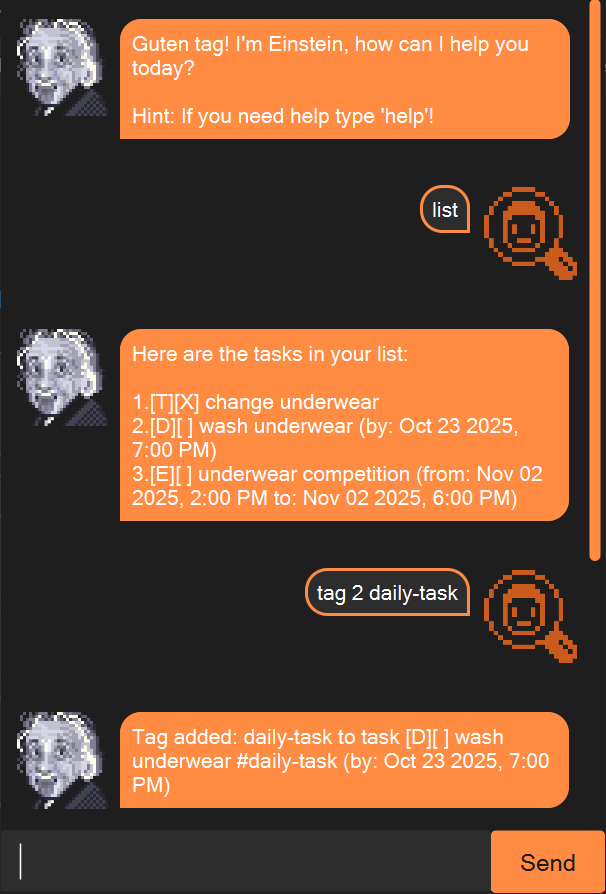

```
         _                   _           _            
        (_)                 / |_        (_)           
 .---.  __   _ .--.   .--. `| |-'.---.  __   _ .--.   
/ /__\\[  | [ `.-. | ( (`\\] | | / /__\\[  | [ `.-. |  
| \\__., | |  | | | |  `'.'. | |,| \\__., | |  | | | |  
 '.__.'[___][___||__][\\__) )\__/ '.__.'[___][___||__]  v1.2
```
# 🧠 Genius Task Management 🤖

Guten tag! Welcome to **Einstein**, your intelligent task management assistant! Einstein is a chatbot designed to help you manage your tasks efficiently. Whether you need to add tasks, mark them as done, or delete them, Einstein is here to make your life easier. With a friendly interface and powerful features, Einstein ensures that you stay organized and productive.

---

## 🚀 Features

Einstein supports the following commands and features:

### 1. Add Tasks

#### 📝 Todo: Add a simple task without a deadline.

**Syntax:**
```bash
todo <description>
```
**Example:**
```bash
todo read book
```

#### ⏰ Deadline: Add a task with a deadline.

**Syntax:**
```bash
deadline <description> /by <date>
```
**Example:**
```bash
deadline return book /by Sunday
```

#### 🗓️ Event: Add a task with a start and end time.

**Syntax:**
```bash
event <description> /from <start> /to <end>
```
**Example:**
```bash
event project meeting /from Mon 2pm /to 4pm
```

### 2. 📋 List Tasks

View all your tasks in a neatly formatted list.

**Syntax:**
```bash
list
```
**Example:**
```bash
list
```

### 3. ✅ Mark Tasks as Done

Mark a task as completed.

**Syntax:**
```bash
mark <task number>
```
**Example:**
```bash
mark 1
```

### 4. ❌ Mark Tasks as Not Done

Mark a task as not completed.

**Syntax:**
```bash
unmark <task number>
```
**Example:**
```bash
unmark 1
```

### 5. 🗑️ Delete Tasks

Remove a task from your list.

**Syntax:**
```bash
delete <task number>
```
**Example:**
```bash
delete 1
```

### 6. 🏷️ Tag Tasks

Add a tag to a task for better organization.

**Syntax:**
```bash
tag <task number> <tag>
```
**Example:**
```bash
tag 1 fun
```

### 7. 🚫 Untag Tasks

Remove a tag from a task.

**Syntax:**
```bash
untag <task number> <tag>
```
**Example:**
```bash
untag 1 fun
```

### 8. 🔁 Help

Display a list of all available commands and their usage.

**Syntax:**
```bash
help
```
**Example:**
```bash
help
```

### 9. 🚪 Exit

Exit the chatbot.

**Syntax:**
```bash
bye
```
**Example:**
```bash
bye
```

---

## 🖼️ User Interface

Here’s a screenshot of Einstein in action:



---

## 🛠️ Getting Started

### Prerequisites

- **Java Development Kit (JDK):** Ensure you have JDK installed on your system. You can download it [here](https://www.oracle.com/java/technologies/javase-jdk11-downloads.html).
- **Command Line Interface (CLI):** Einstein runs in the terminal or command prompt.

### Running Einstein

#### Download the Code:
Clone or download the repository containing the Einstein chatbot code.

#### Navigate to the Directory:
Open your terminal or command prompt and navigate to the directory where the code is located.

#### Compile the Code:

```bash
javac Einstein.java
```

#### Run the Chatbot:

```bash
java Einstein
```

#### Interact with Einstein:
Once the chatbot starts, you can begin typing commands to manage your tasks.

---

## 🎯 Example Usage

### Adding Tasks

```bash
> todo read book
```
```
Einstein
Got it. I've added this task:
  [T][ ] read book
Now you have 1 task in the list.
```

### Listing Tasks

```bash
> list
```
```
Einstein
Here are the tasks in your list:
1.[T][ ] read book
```

### Marking a Task as Done

```bash
> mark 1
```
```
Einstein
Nice! I've marked this task as done:
  [T][X] read book
```

### Deleting a Task

```bash
> delete 1
```
```
Einstein
Noted. I've atomized this task:
  [T][X] read book
Now you have 0 tasks in the list.
```

### Tagging a Task

```bash
> tag 1 fun
```
```
Einstein
Tag added: fun to task [T][X] read book #fun
```

### Getting Help

```bash
> help
```
```
Einstein
Here are the commands I understand:
...
```

---

## 🚨 Error Handling

Einstein is designed to handle errors gracefully. If you enter an invalid command or task number, Einstein will provide a clear error message to guide you.

### Examples of Error Handling

#### Invalid Command

```bash
> blah
```
```
Einstein
ARGH! I do not understand you, which is weird,
because I usually understand most things. Invalid command!
```

#### Blank Task Number

```bash
> delete
```
```
Einstein
Nein! You must provide a task number to delete.
Use: delete <task number>
```

#### Invalid Task Number

```bash
> delete 999
```
```
Einstein
Invalid task number! Please give me something valid!
```

---

## 🌟 License

This project is licensed under the **MIT License**. See the LICENSE file for details.

---

## 🙏 Acknowledgments

- **DeepSeek:** For providing the gradient text styling and ASCII art as well as for writing this README!
- **Java:** For making this project possible with its robust and versatile programming language.

---

Enjoy using Einstein to manage your tasks efficiently! If you have any questions or feedback, feel free to reach out. 🚀

---
